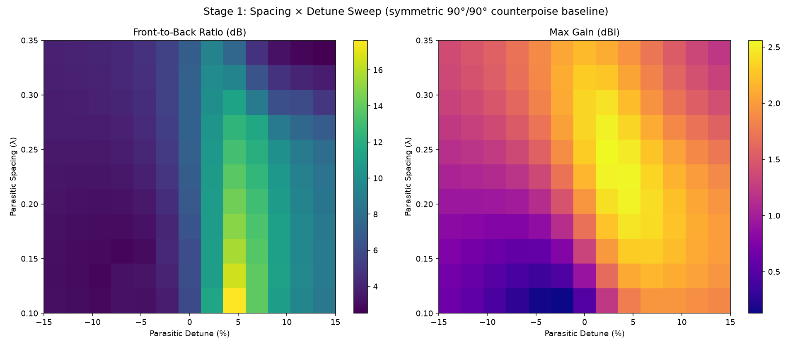
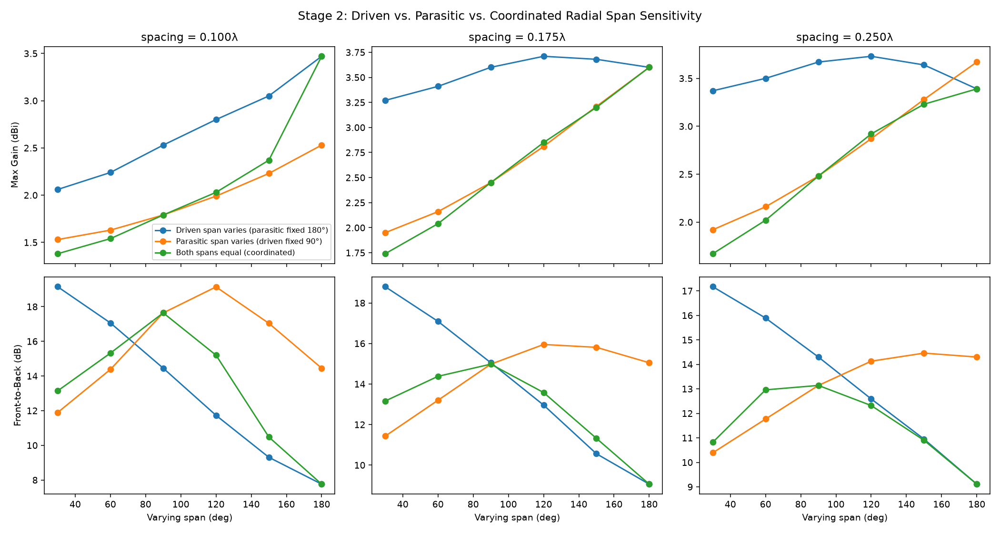
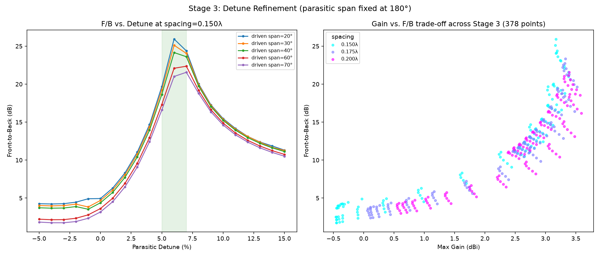
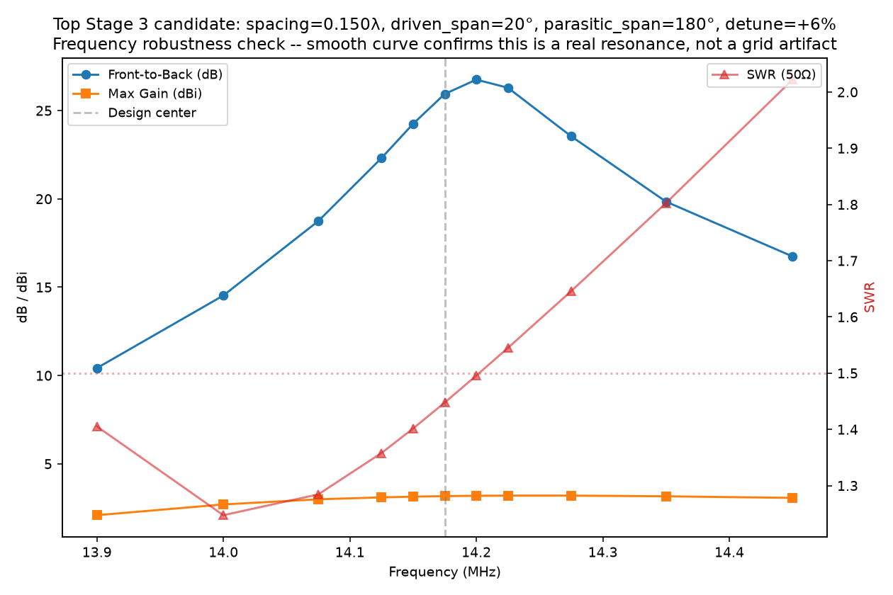

# Driven + Passive Vertical Array — Parameter Space Mapping

Study of AntennaSim's `parasitic-vertical` template: an elevated quarterwave
vertical (driven, with its own 2-radial counterpoise) paired with a second,
unfed quarterwave vertical (passive reflector/director, also with its own
independent counterpoise) along an axis of directivity. All sweeps target
20m (design frequency 14.175 MHz), feed height 2.0m, radial end height 1.0m.

Every simulated point in this study calls the actual template code
(`frontend/src/templates/parasitic-vertical.ts` — `generateGeometry` /
`generateExcitation`) directly, bundled with esbuild and run against the
live AntennaSim backend (`/api/v1/simulate`). There is no hand-reimplemented
geometry math in the sweep harnesses — every data point is guaranteed
identical to what the UI would produce for the same parameter values.

## Method

Full grid search across the whole parameter space (spacing, detune, and
independent bearing/span/length/end-height for both elements' counterpoises)
is intractable — even a coarse 5-level grid across ~8 real dimensions is
~5⁸ ≈ 390,000 simulations. Instead this was a staged, coarse-to-fine search:

1. **Stage 1** — coarse 2D grid: `parasitic_spacing` × `parasitic_detune`,
   counterpoises held at a symmetric baseline (driven span 90° pointed away
   from the array axis, parasitic span 90° pointed along it). 143 points.
2. **Stage 2** — radial-span sensitivity, crossed with 3 representative
   spacings from Stage 1. Three regimes: driven span varies (parasitic span
   fixed at 180°), parasitic span varies (driven span fixed at 90°), and
   coordinated (both spans equal). Detune held at the Stage 1 sweet spot
   (+5%). 54 points.
3. **Stage 3** — detune refinement around the best region found in Stage 2
   (narrow driven span + wide/180° parasitic span), crossed with spacing and
   driven span. 378 points.
4. **Frequency robustness spot-check** — the top Stage 3 candidate re-run
   across an 11-point frequency sweep with *fixed* geometry (not
   re-optimized per frequency) to confirm the result is a genuine, smooth
   resonance rather than a coarse-grid quantization artifact.

Raw data: `data/*.csv`. Harness source: `harness/*.ts`. Figures: `figures/*.png`.
To regenerate figures: create a throwaway venv, `pip install matplotlib numpy`,
then run `make_figures.py` (matplotlib is intentionally *not* a project
dependency — this is a one-off analysis tool, not part of the app).

## Key findings

### 1. Baseline spacing × detune (Stage 1)

*Figure 1. Front-to-back ratio (left) and max gain (right) across the full Stage 1 grid — parasitic spacing (0.10λ–0.35λ, y-axis) vs. parasitic detune (−15% to +15%, x-axis), with both elements' counterpoises held at the symmetric 90°/90° baseline. F/B forms a vertical ridge centered on +5% to +6% detune that gets stronger as spacing shrinks; gain forms a separate bright band roughly centered on 0% to +5% detune that gets stronger as spacing grows. The two peaks don't coincide — this is the source of the gain/F-B trade-off discussed below.*

With a plain symmetric 90°/90° counterpoise, **F/B peaks at *close* spacing
(~0.10λ) and +5% to +6% detune (reflector, not director)** — the opposite of
what the KJ6ER "Dominator" halfwave EFHW parasitic array uses (director,
6% shorter, ~0.12λ spacing), confirming these two antenna topologies aren't
interchangeable recipes. But peak F/B at close spacing comes with a real
cost: gain drops sharply there (~1.8 dBi at 0.10λ vs. ~2.5+ dBi at 0.25λ).
This gain penalty — not a pattern or SWR failure — is almost certainly what
originally read as "close spacing doesn't work."

### 2. Radial span sensitivity (Stage 2)

*Figure 2. Three regimes compared across three spacings (0.10λ, 0.175λ, 0.25λ columns): driven radial span varied with parasitic fixed at 180° (blue), parasitic radial span varied with driven fixed at 90° (orange), and both spans varied together (green). Top row is max gain, bottom row is front-to-back ratio, both vs. the varying span in degrees (x-axis). The bottom row is the key result: the blue (driven) curve falls monotonically as span widens, while the orange (parasitic) curve rises to a peak around 90-120° before falling — opposite slopes that explain why narrowing the driven span while widening the parasitic span outperforms moving them together (green, which tracks whichever curve is worse at each point).*

Confirms the hypothesis directly: **narrowing the driven element's radial
span increases F/B monotonically, while widening the parasitic element's
span increases F/B up to a peak around 90-120° before declining.** The two
effects are complementary, not redundant — the coordinated (both-equal)
sweep consistently underperforms the asymmetric narrow-driven /
wide-parasitic configuration at the same spacing. Best balanced result
found here: spacing=0.175λ, driven_span=60°, parasitic_span=180° → gain
3.41 dBi, F/B 17.09 dB, SWR 1.15 — already beating every Stage 1 result on
every metric simultaneously.

Elevation angle stayed rock-stable at 20-25° across all 54 points in this
stage — no sign of the takeoff angle creeping toward NVIS territory here.

### 3. Detune refinement (Stage 3)

*Figure 3. Left: front-to-back ratio vs. parasitic detune at spacing=0.150λ, one curve per driven radial span (20°-70°), parasitic span fixed at 180°. All five curves share the same sharp, symmetric peak location (shaded band, +5% to +7%) regardless of driven span — detune tuning is largely independent of driven span, but the peak height is not (narrower driven span reaches a taller peak). Right: every one of the 378 Stage 3 points plotted as gain vs. F/B, colored by spacing. The upward-sloping band shows gain and F/B rising together up to a point, then the highest-F/B points (top-left tail, mostly cyan/0.150λ) trade gain away as detune pushes past the peak — the visible "hook" shape at the top of the cloud is the resonance curve folding back on itself past optimal detune.*

With parasitic span fixed at 180° and driven span narrowed further, the
detune sweet spot sharpens into a tight, symmetric resonance peak around
**+6% to +7%** (not the +5% found under the old symmetric baseline — the
optimum shifts as the span configuration changes, confirming these
parameters interact rather than being independently tunable). Best point:
**spacing=0.150λ, driven_span=20°, parasitic_span=180°, detune=+6% → gain
3.17 dBi, F/B 25.94 dB, SWR 1.45, elevation 25°.**

The gain/F-B Pareto scatter (right panel) shows the general shape of the
trade-off across the full 378-point Stage 3 dataset: F/B above ~20 dB is
achievable, but costs gain and tightens SWR bandwidth as spacing shrinks.

### 4. Frequency robustness of the top candidate

*Figure 4. Fixed geometry (spacing=0.150λ, driven_span=20°, parasitic_span=180°, detune=+6%) re-simulated at 11 frequencies from 13.9 to 14.45 MHz — nothing about the antenna changes between points, only the drive frequency. F/B (blue) and gain (orange, left axis) both trace smooth, continuous curves with no discontinuities; SWR (red, right axis, dotted line marks 1.5:1) climbs steadily as frequency increases. The smoothness of all three curves — rather than an isolated spike at one frequency — is the evidence that the 25.9 dB result is a genuine resonance effect, not a grid-quantization coincidence.*

The 25.94 dB F/B figure is **not a fragile, single-frequency artifact.**
Re-simulating the exact same fixed geometry across an 11-point frequency
sweep produces a smooth, physically sensible bell curve — F/B rises from
10.4 dB at 13.9 MHz to a true peak of **26.75 dB at 14.20 MHz**, then falls
back to 16.7 dB at 14.45 MHz. Gain and elevation angle stay essentially flat
throughout. A coarse-grid quantization coincidence would not produce this
kind of smooth, continuous curve — this is real antenna behavior.

**Caveat:** SWR stays under 1.5:1 only from about 13.9-14.2 MHz; it climbs
to 2.0:1 by 14.45 MHz. This is a genuinely "peaky," high-Q reflector
configuration, not a broadband one — a real trade-off for chasing such deep
F/B, and worth deciding whether it matters for your operating style.

## Leading candidates

| Priority | Spacing | Driven span | Parasitic span | Detune | Gain | F/B | SWR |
|---|---|---|---|---|---|---|---|
| Max F/B | 0.150λ (3.17m) | 20° | 180° | +6% | 3.17 dBi | 25.9 dB (peaks 26.8 @ 14.20 MHz) | 1.45 |
| Balanced (recommended for a first build) | 0.175λ (3.70m) | 60° | 180° | +6% | 3.41 dBi | 17.1 dB | 1.15 |
| Best SWR / broadest match | 0.200λ (4.23m) | 60-70° | 180° | +5-6% | ~3.5 dBi | ~17-19 dB | ~1.0-1.1 |

**Known caveat on the max-F/B candidate:** driven radial span of 20° means
two ~5m radials running nearly parallel for most of their length — an NEC2
model doesn't care, but it's a real dressing/build challenge (keeping them
from touching or coupling) that the simulation can't capture.

## Open questions / next stages

- Radial bearing sensitivity (both elements) hasn't been swept yet — only
  span. The baseline bearings (driven pointed away from the array axis,
  parasitic pointed along it) were held fixed throughout this whole study.
- Independent radial length and end-height (droop/slope) haven't been swept
  — both were left at their "auto λ/4" and 1.0m defaults throughout.
- No real-world validation yet. Real ground, actual whip velocity factor,
  and connector/choke losses will likely shift the true sweet spot — same
  caveat KJ6ER notes in his own PERformer documentation.
